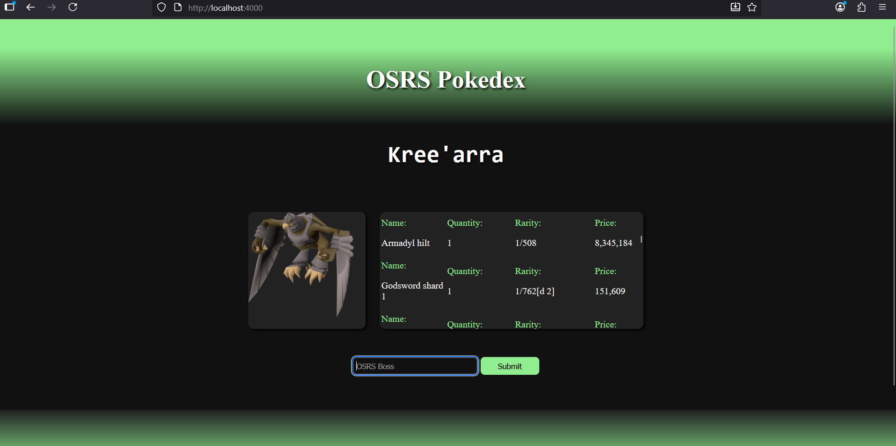
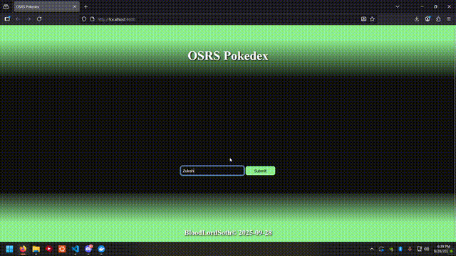

# OSRSPokedex

## Description
```
- Type in a boss name, and scrape boss info from wiki.
- Uses puppeteer/chromium to scrape wiki for Boss info.
```

<br>




## Installation
```
- Image is containerized and on Docker hub.
- Docker run -d -p 4000:4000 bloodlordsoth/osrs-pokedex:latest
```
[Docker](http://www.docker.com)

---
### BloodLordSoth

[Github](http://github.com/BloodLordSoth) | [Youtube](http://www.youtube.com/@BloodLordSoth)
